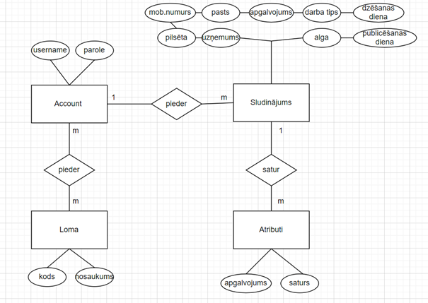

# Sistēmas ER modelis
Sistēmas ER-modelis sastāv no 4 entitijām kas nodrošina pamat informācijas uzglabāšanu , apstrādi , autorizāciju un reģistrāciju. 
Entitijas Account un Loma ir saišu “Many To Many”, ir 2 iemesli, kāpēc tas būtu jādara: Izstrades ir izmantots Frameworks – "Spring” un priekš drošibas ir izmantota “Spring Security” un deļ tas ir vieglāk un labāk izmantot tādu saišu, lai nākotnē nevajāg nekas mainīt. Otrs iemesls ir lai nav “Administratoram” iedot tādas pašas funkcijas kā “Lietotajs”, un kontam būtu divas lomas.

