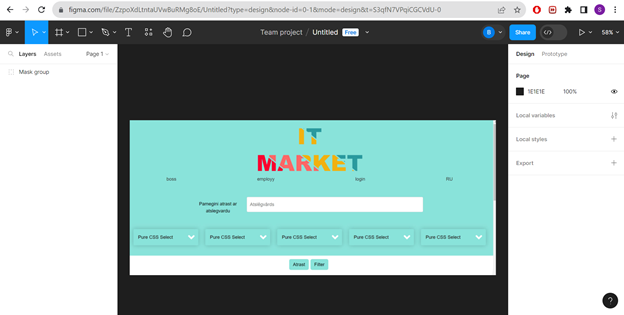
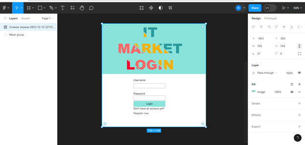
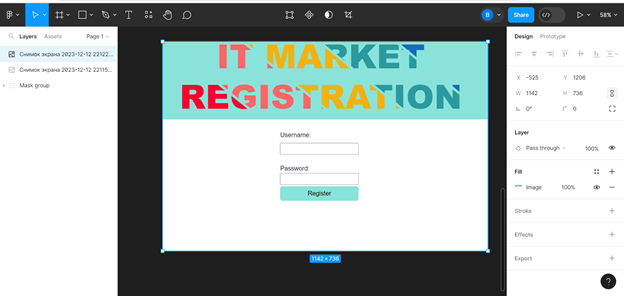

2.2 Funkcionālās prasības

1.	Jānodrošina iespēja reģistrēt jaunu lietotāju. 
1.1.	Jāparedz ieejas informācijas par lietotāju (skat. Ieejas informācijas apraksts 4. punkts)  ievadīšana un pārbaude un formāta pareizību.
1.2.	Ja kāds no obligātiem laukiem nav ievadīts, tad izvadīt par to kļūdas paziņojumu.
1.3.	Salīdzināt ievadīto lietotāja vārdu ar sistēmā jau eksistējošo lietotāju vārdiem un izvadīt paziņojumu, ja tie sakrīt.
1.4.	Pārbaudīt paroli uz pietiekošo drošības pakāpi. Ja tas neatbilst, izvadīt paziņojumu
2.	Jānodrošina lietotāja autorizācija.
2.1.	Ja lietotāja statuss ir aktīvs sistēmai ir jānodrošina autorizācija, pieslēdzoties ar username un paroli.
2.2.	Ja statuss ir neaktīvs, tad sistēmai ir jāieslēdz autorizācijas lapu.
2.3.	Ja kāds no laukiem nav ievadīts, izvadīt par to paziņojumu.
3.	Jānodrošina iespēju lietotājam mainīt savus datus 
3.1.	Izvādīt esošus datus 
3.2.	Jāparbauda jaunus datus un izvadīt paziņojumu ja viņi satur kļūdu.
4.	Jānodrošina iespēju lietotājam izveidot jauno sludinājumu 
4.1.	 Ja kāds no obligātiem laukiem nav ievadīts, tad izvadīt par to kļūdas paziņojumu.
4.2.	Jāparbauda datus un izvadīt paziņojumu ja viņi satur kļūdu.
4.3.	Paradit lietotājam sludinājuma piemēru ar viņa ievadītājām datiem .
5.	Jānodrošina iespēju lietotājam nomainīt datus sava sludinājumā.
5.1.	 Ja kāds no obligātiem laukiem nav ievadīts, tad izvadīt par to kļūdas paziņojumu.
5.2.	Jāparbauda datus un izvadīt paziņojumu ja viņi satur kļūdu.
5.3.	Paradit lietotājam sludinājuma piemēru ar viņa ievadītājām datiem .
6.	Jānodrošina administratoram pieeju pie specialam funkcijam   
6.1.	 Rediģēt lietotājus.
6.2.	Rediģēt sludinājumus .
6.3.	Autorizēties ar administratora tiesībam.
7.	Jānodrošina iespēju lietotājam pārskatit visus sludinājumus    
7.1.	 Jārealizē filtru ar visam iespējamam parametriem .
7.2.	 Jārealize dinamiskas lapas ar sludinājumiem  .

2.3 Nefunkcionālās prasības

1.	Sistēmas saskarnes valodai ir jābūt latviešu valodai.
2.	Jānodrošina tīmekļa lietojumprogrammas pielāgošanas ekrāna izmēriem, kas              mūsdienās tiek lietoti, lai to varētu izmantot uz dažādiem monitora izmēriem.
3.	Dizainam ir jābūt ērtam un saprotamam .
4.	Tekstam ir jābūt Arial fontā tumšā krāsā.  
5.	Piekļuve pie administratora iespējam jābut aizsargātam 
6. Galvenas lapas skice :   
 

	2.att. Galvenas laps skice 

Autorizācijas lapas skice :
 
3.att. Autorizācijas lapas skice

Reģistrācias lapas skice : 
 
4.att. Reģistrācijas lapas skice 
