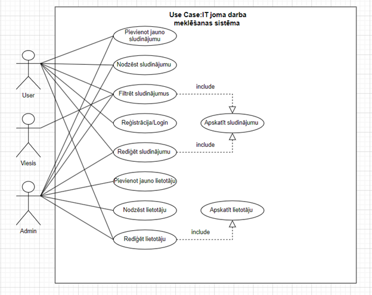

Sistēmā būs realizēti 4 lomas (ceturto pievienošu velāk),viesis,user,admin un owner.

Viesis : ir iespēja tikai pārskatit sludinājumus .

User : ir iespēja pārskatit sludinājumus un atbildēt uz viņiem

Admin : visas klasiskas administratora iespējas (rediģēt,dzēst,pievenot datus)

Owner : var veidot sludinājumus un apskatīt kandidatus kuri atbildēja uz vakancem .  

